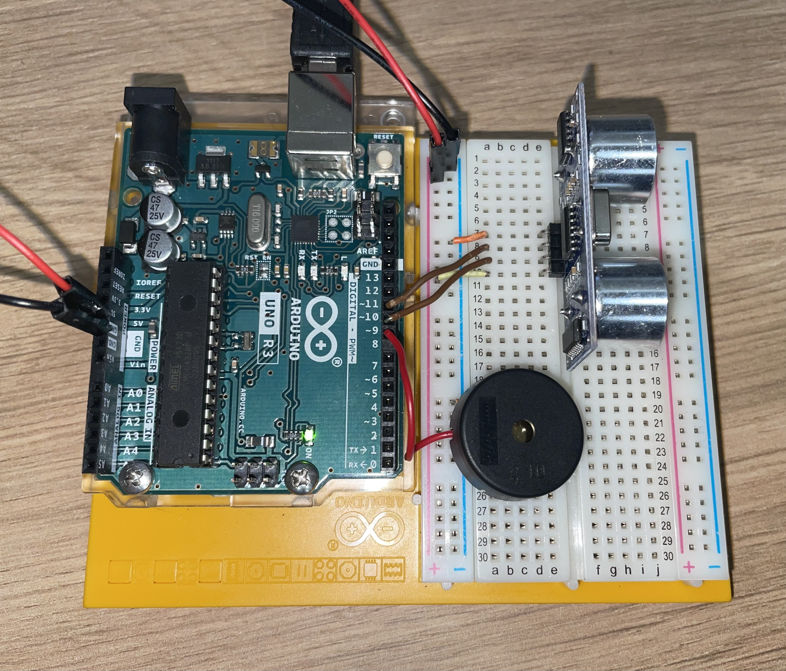

This project uses an ultrasonic distance sensor (such as the HC-SR04) to measure the distance between the sensor and an object. The Arduino continuously monitors the distance, and when an object is detected within a specified range, it triggers an alarm. The alarm is activated by a piezo buzzer, which produces a loud sound to alert the user.

Parts required:
- Ultrasonic distance sensor (HC-SR04)
- piezo

