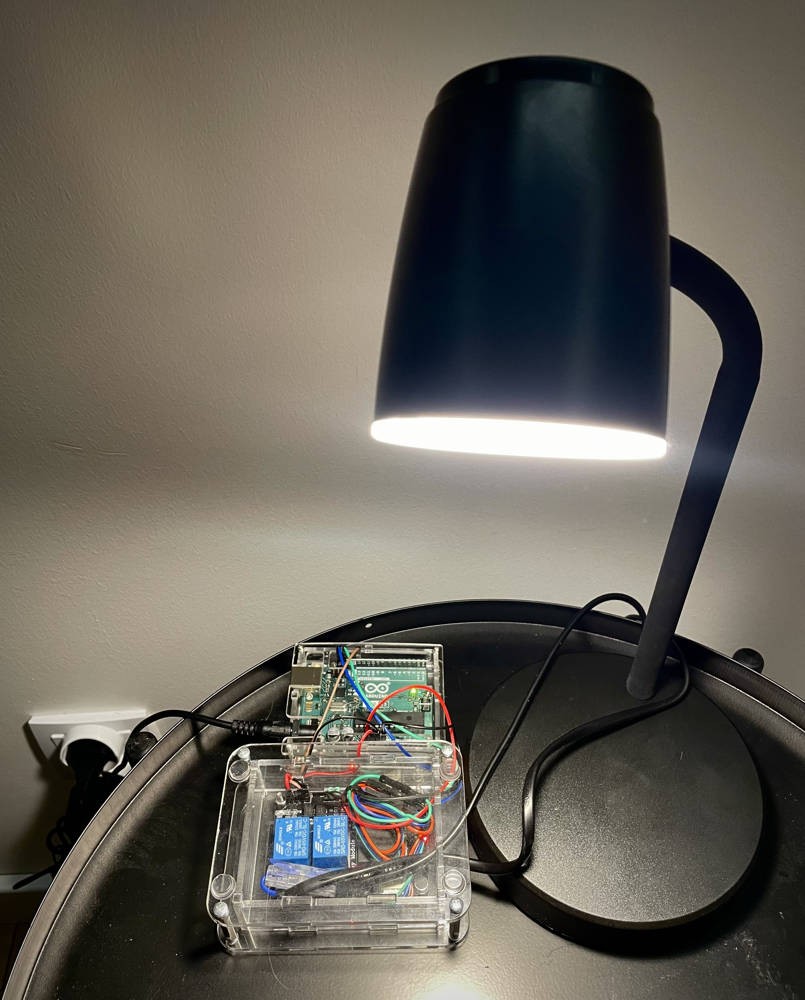

The project focuses on controlling light switching (on/off) using a voice recognition module. The system recognizes simple voice commands and sends signals to a microcontroller, which controls the light through a relay.

Parts required:
- Offline voice recognition module DFRobot SEN0539-EN
- Relay module 10A/250VAC

 