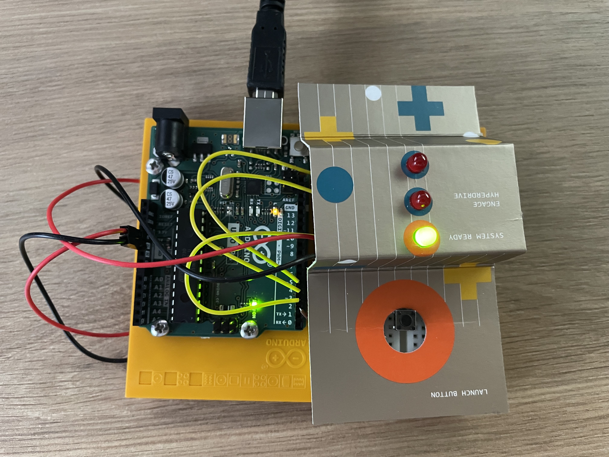
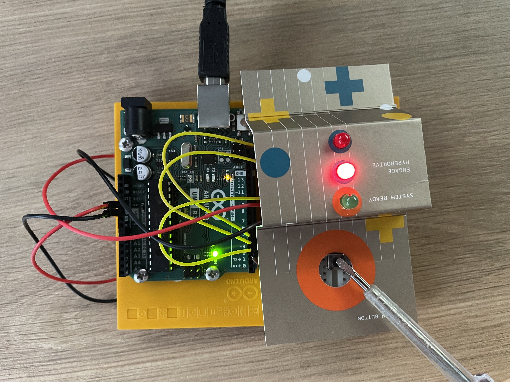

After pressing the button, the green LED turns off and the red LEDs start flashing alternately.

Parts required:
- one green LED
- two red LEDs
- push button
- 10k ohm resistor
- three 220 ohm resistors

