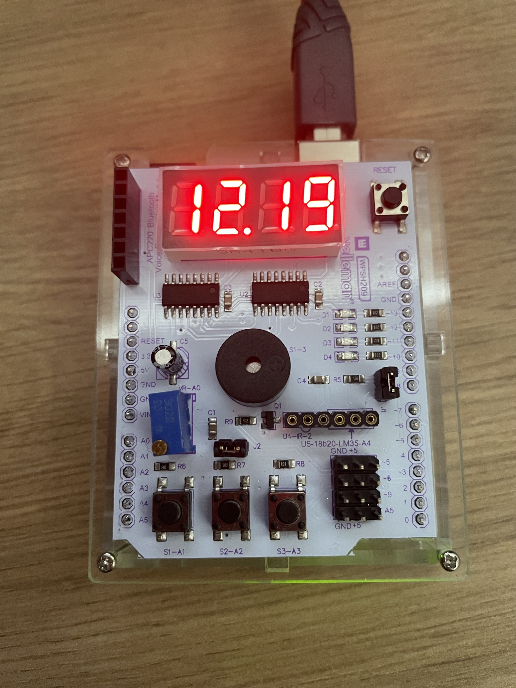

This project is a stopwatch built with Arduino that allows users to start, pause, and reset the timer. It uses a display to show elapsed time and buttons for control.

Parts required:
- multifunctional shield Velleman VMA209

 