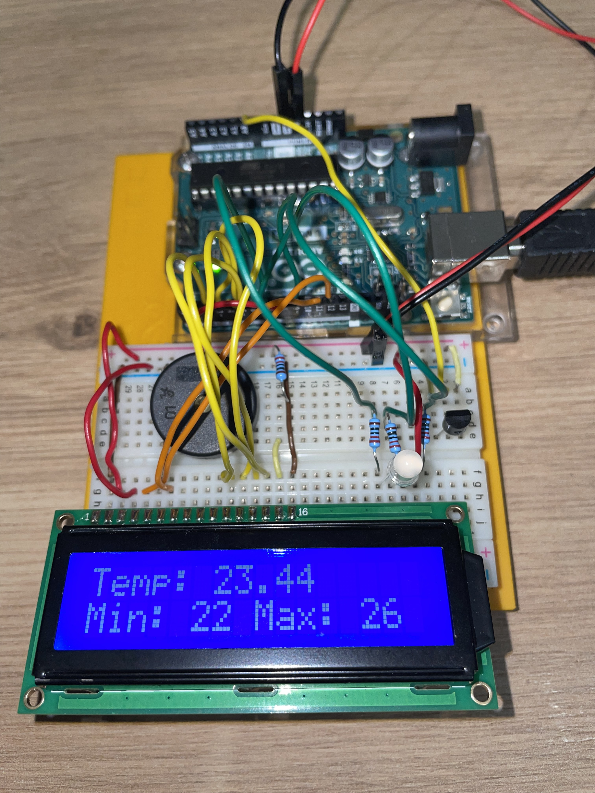
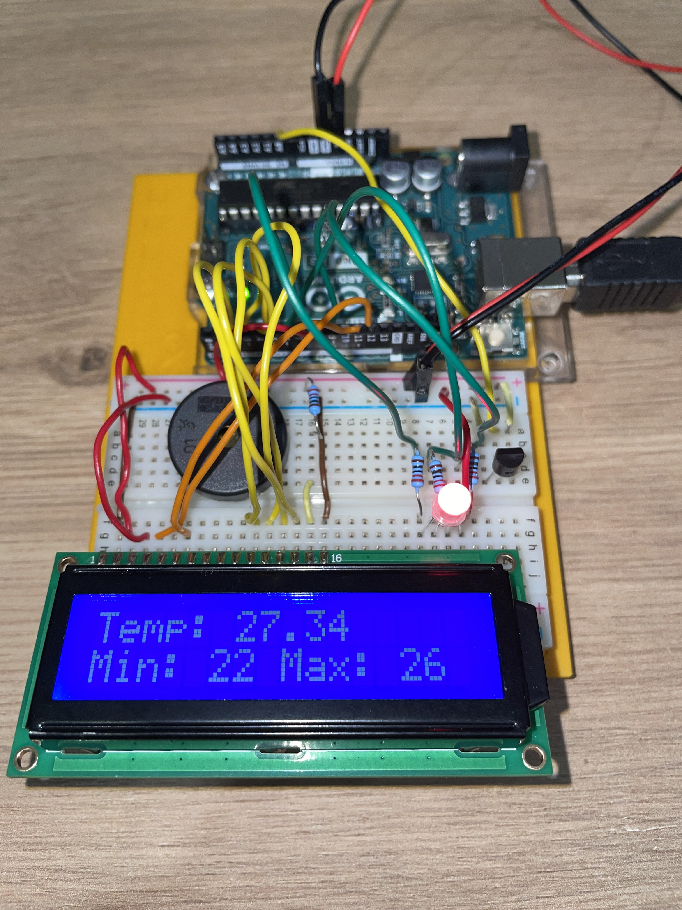
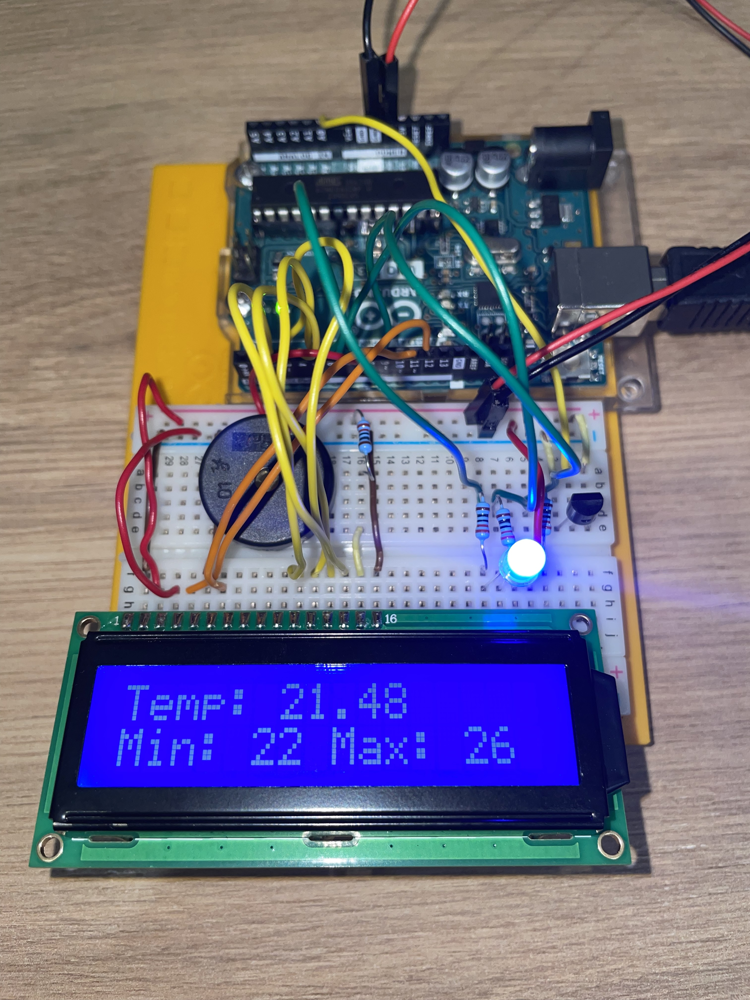

This Arduino-based smart temperature sensor measures and displays the temperature in real time. It provides both visual and audio alerts based on temperature conditions:
- Low Temperature: Emits a sound signal and lights up blue.
- High Temperature: Emits a sound signal and lights up red.

Ideal for monitoring temperature-sensitive environments, this project combines sensors, LEDs, and a buzzer to provide immediate feedback.

Parts required:
- 16x2 LCD screen
- one LM35DZ temperature sensor
- one RGB LED
- piezo
- three 220 ohm resistors

