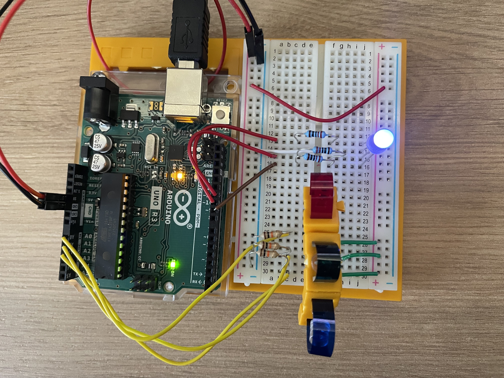
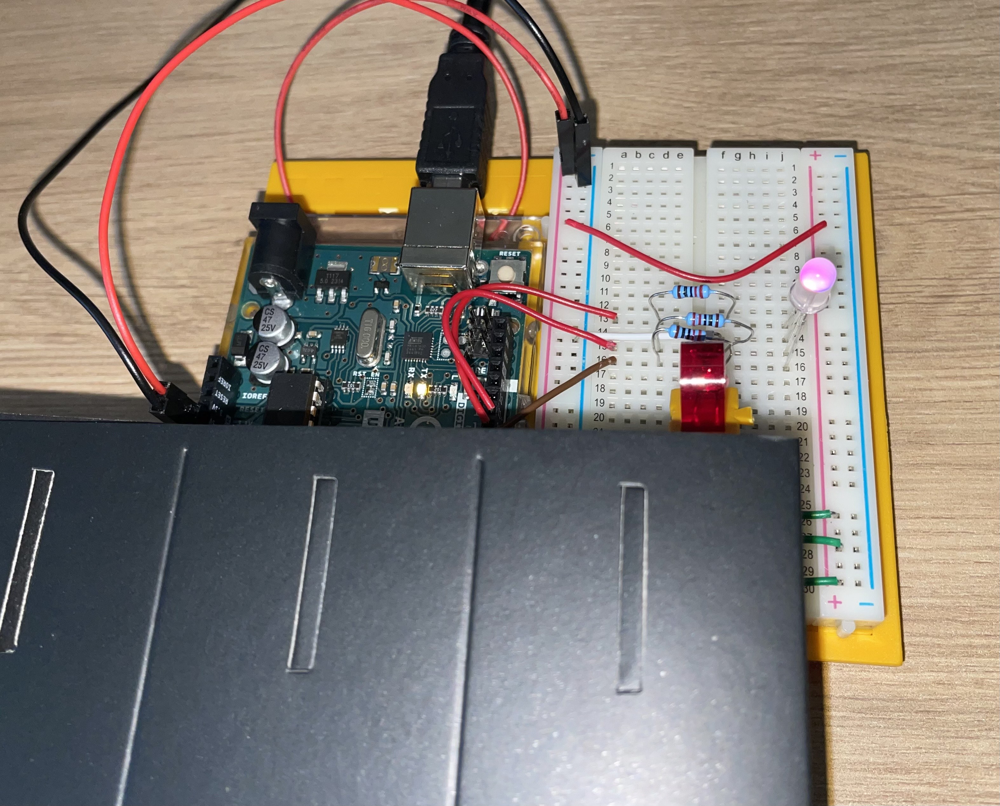
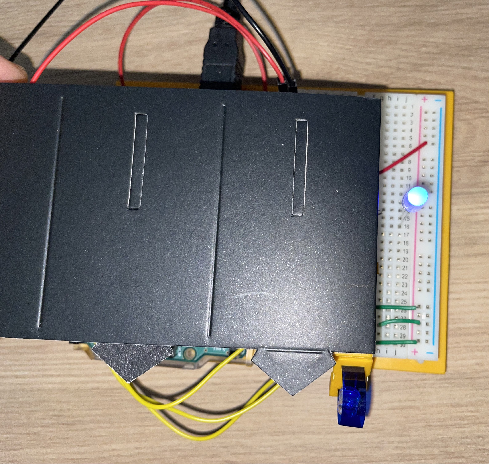

Show the correct RGB color of the LED based on three photoresistors.

Parts required:
- one RGB LED
- three 10k ohm resistors
- three 220 ohm resistors
- three photoresistors
- red, green and blue colored gels

