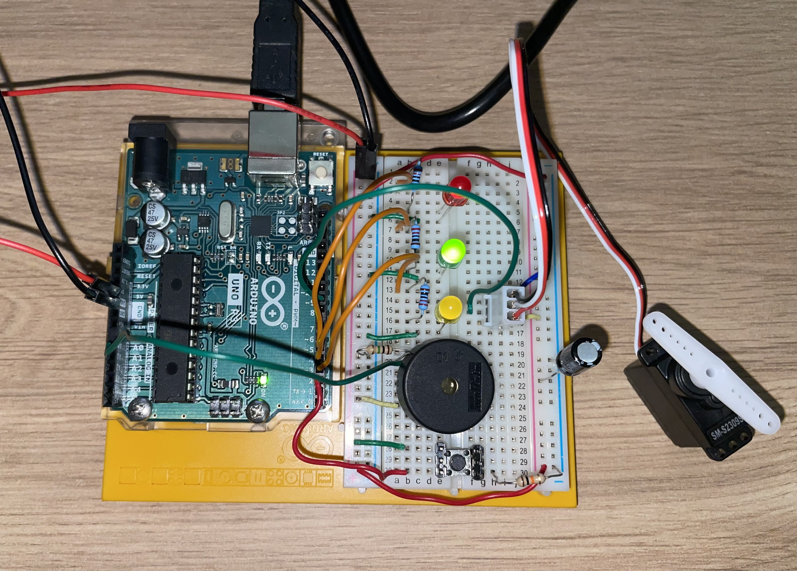

Controlling the servo motor with a piezo and push button.

Parts required:
- 1m ohm resistor
- 10k ohm resistor
- three 220 ohm resistors
- piezo
- servo motor
- push button
- one red LED
- one yellow LED
- one green LED
- 100 uF capacitor

