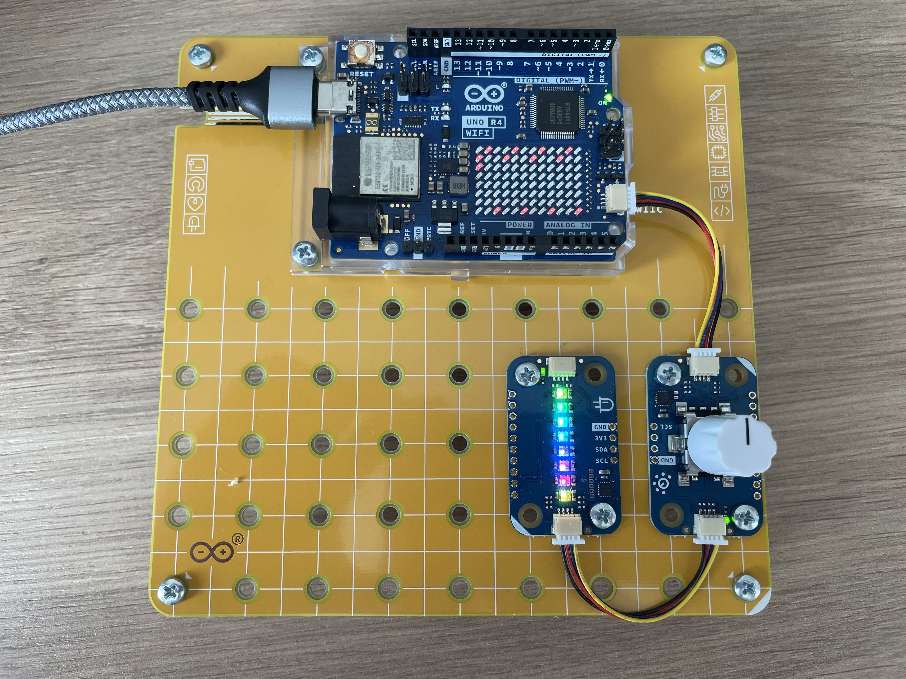

Getting Started is a built-in starter project for the Arduino Plug and Make Kit. It demonstrates several basic module configurations (LEDs, buzzer, sensors).

Parts required:
- Modulino Distance
- Modulino Pixels
- Modulino Movement
- Modulino Thermo
- Modulino Knob
- Modulino Buzzer
- Modulino Buttons

